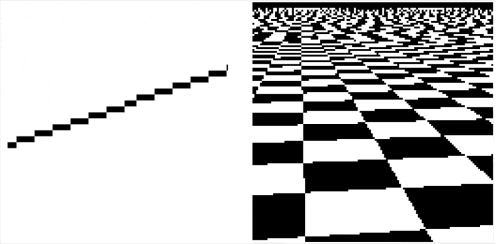

This post is a personal study note based on CMU 15-462 (Computer Graphics) 2020/fall lectures.
>All original lecture slides and videos are copyrighted by the instructors.

강의에 대한 정보와 자료는 아래 홈페이지에서 확인할 수 있습니다.
https://15462.courses.cs.cmu.edu/fall2020/home

본 포스팅은 강의 내용을 바탕으로 하되, 이해를 돕기 위해 별도의 자료 조사와 개념 정리를 덧붙여 작성했습니다. 따라서 원 강의 내용에 추가적으로 개인적인 학습 자료가 다수 포함되어 있습니다.

---

## 들어가며
몇 번의 강의에 걸쳐 레스터와 과정에 대해 배워 볼 것임.

컴퓨터 그래픽스에서  화면에 요소를 표시하는 두 가지 주요 기술이 존재.
Rasterization, Ray tracing

**Rasterization**
기본적으로 각 기본 요소에 대해 각 삼각형을 그리라는 의미.
- 각 **삼각형**에 대해 어떤 픽셀이 밝아져야 할까 ?
- 매초 수십억 개의 삼각형을 표시할 수 있음.
- 단점)실사 이미지나 실사 조명효과를 생성하기 어려움.
- 그래서 2D 벡터 아트나 만화에 적합하다.
 

**Ray tracing**
광선 추척을 기반으로 사실적인 렌더링 수행
- 각 **픽셀**에 대해, 어떤 프리미티브이 보이는지 확인.
- 실사에 가까운 이미지 생성을 쉽게 만들어 줌
- 속도가 느림

## 3D Image Generation Pipeline(s)
레스터화 파이프라인에 대해 얘기할 예정

그래픽에서 이미지 생성을 파이프라인이라는 관점에서 이야기.

**파이프라인이란 무엇일까 ?**
-> 일련의 단계로 계산을 구조화하는 것.

- 입력: 어떤 이미지를 그리고 싶은가 ?
- 단계: 입력-> 출력으로부터의 변환의 과정
- 출력: 최종 결과물

## Raterization Pipeline

현대의 실시간 이미지 생성을 래스터화를 기반으로 한다.
- Input: 3D 프리미티브(사실상 모두 삼각형)
	- 추가 속성(ex. Color)을 가질 수도 있음
- Output: 비트맵 이미지(깊이, 알파 등 포함 가능)

### 왜 삼각형인가 ?

래스터화 파이프라인은 점과 선을 포함한, 모든 프리미티브를 **삼각형**으로 변환한다.

Why?
- 어떤 모양이든 근사 가능
- 항상 평면적, 법선이 명확함
- 꼭짓점에서 데이터를 보간하기 쉬움

>모든 것이 삼각형으로 환원되면, 그리기에 매우 최적화된 파이프라인을 만드는 데 집중할 수 있음.

**The Rasterization Pipeline**

**Computing triangle coverage**

정확한 커버리지를 계산하는 것은 실용적이지 않다.

커버리지를 결정하는 문제를 **샘플링** 문제로 바라보자.

정확/해석적 해답을 계산하지 않고, 여러 샘플 포인트를 테스트한다.
충분한 포인트 수와 샘플 위치를 잘 선택할 수 있으면 커버리지 범위를 상당히 정확하게 추정할 수 있다.

## Sampling
>샘플링 = 신호를 측정하는 것
- 신호를 샘플 집합으로 인코딩
- 원리적으로는 특정 지점의 값을 표현(현실에서 측정은 어려움)

**Q. 샘플들의 집합이 주어졌을 때 원래 신호를 어떻게 재구성할 수 있을까 ?**

### Reconstruction
>샘플 집합으로부터 신호를 생성
- 함수 값을 보간하거나 근사하는 함수를 구성

그냥 샘플들을 잇게되면, $f(x_2)$와 $f(x_3)$ 사이 큰 변화를 놓칠 것임.

-> 그냥 샘플링을 좀 더 촘촘히 하면 됨.

이러한 원리는 위에서 다룬 오디오 뿐만이 아니라 이미지에서도 다르지 않게 적용됨.

**커버리지 확보를 위한 샘플링**

삼각형의 모서리가 샘플 포인트(픽셀 정중앙 지점)를 정확히 지나갈 때, 위쪽 or 왼쪽 모서리면 삼각형 내부로 분류.
- 위쪽 모서리: 다른 모든 모서리보다 위에 있는 수평 모서리
- 왼쪽 모서리: 정확히 수평이 아니면서 삼각형의 왼쪽에 있는 모서리

컴퓨터는 연속적인 값을 처리하지 못하고, 이산적인 값만 처리할 수 있으므로
연속적인 신호를 컴퓨터가 처리할 수 있도록 샘플링 과정을 통하여 디지털 정보로 변환하고, 다시 인간이 인식할 수 있도록 reconstruct 과정을 통해 연속 신호로 변환한다.

1차원 신호는 여러 주파수의 중첩으로 표현할 수 있다.

**고주파 신호를 언더샘플링하면 aliasing이 발생한다.**

**언더샘플링이란?**
- 신호의 최고 주파수에 비해 샘플링 주파수가 충분히 높지 않은 경우

푸리에 분해에 의해 신호는 여러 여러 개의 서로 다른 주파수 사인파의 합으로 표현 가능하다.

위 이미지에서 가장 높은 주파수 성분인 $f_5(x)$가 충분히 샘플링되지 않아 reconstruct결과가 저주파 신호처럼 보여진다.

이로인해 원래 신호의 고주파 성분이 언더샘플링으로 인해 reconstruct후 저주파로 위장해 나타나는 현상인 **aliasing**이 발생한다.

위 현상을 방지하기 위해서는 나이퀴스트 조건인 최대 주파수의 최소 2배 이상으로 샘플링해야 한다.
$$
f_s \geq 2f_{max}
$$

`예) 신호 최고 주파수가 20kHz인 경우 필요한 최소 샘플링은 40kHz이상.`

**오디오 신호 뿐만이 아니라 이미지도 주파수로 분해할 수 있다**

위 이미지에서 왼쪽부터 낮은 주파수 성분 -> 높은 주파수 성분으로의 이미지.

공간에서의 **aliasing**과 시간적 **aliasing**의 예시도 살펴보자.

**Spatial aliasing:** $sin(x^2 + y^2)$함수

중간 지점에서 개별 픽셀로 표현할 수 있는 한계에 가까워지고, 이후 $x$방향으로 진행할 수록 마치 저주파처럼 보인다.(실제로는 고주파이지만 언더샘플링 됨)

**Temporal aliasing:** 마차 바퀴 효과(wagon wheel effect)

카메라의 프레임레이트(시간 샘플링률)가 30fps로 회전하는 바퀴에 비해 너무 낮다.

그렇다면, aliasing이 언제 발생하는지 어떻게 알 수 있을까 ?

### Nyquist-Shannon theorem
대역폭이 제한된 신호가 있다고 가정해보자.
($w_0$ 이상의 주파수를 가지지 않는다.)

오디오의 경우 low-pass 필터링된 신호일 것이고,
이미지의 경우 블러 처리된 이미지일 것이다.

샘플링 주기 $T=1/(2ω0)$으로 샘플링하면 신호를 완벽하게 재구성(reconstruct)할 수 있다.

그리고 보간은 "sinc filter"를 사용하여 수행된다. $\mathrm{sinc}(x) = \frac{1}{\pi x} \sin(\pi x)$

### Challenges of sampling in computer graphics

컴퓨터 그래픽스에서 신호가 항상 대역폭 제한이 있는 것은 아니다.

이상적인 재구성 필터(sinc)의 무한한 범위는 효율적인 구현에 있어 비현실적이다.

**Aliasing artifacts in images**

불완전한 Sampling + 불완전한 Reconstruction은 이미지 아티팩트를 유발함.
- 정지 이미지에서의 **jaggies**
- 애니메이션에서의 **Roping** or **shimmering**
- 이미지 고주파 영역에서 나타나는 **Moire** 패턴

### Aliasing을 어떻게 줄일 수 있을까 ?

무엇을 하더라도 **Aliasing**을 피할 수는 없지만, Sampling과 Reconstruction이 신호와 최대한 비슷해보이도록 할 수는 있음.

픽셀을 **전체 사각형** 하나의 빛으로 생각한다면 단순히 픽셀의 중앙을 지나간 값으로 밝히는 것이 아니라, 방출되는 총 빛의 양이 픽셀 안의 총 빛의 양과 같아야 자연스러울 것이다.
`e.g) 빨간색 삼각형이 픽셀의 30%를 덮으면 빨간색으로 30%만큼만 빛나야 함.`

### 샘플링으로 coverage(x,y)를 근사적으로 적분하기

**Supersampling**

위의서 설명한 **나이퀴스트-섀넌 정리**에서 영감을 받아서 진행함.
픽셀 안을 더욱 촘촘히 나눠서 샘플링을 진행한다.

**Resampling**

**Displayed result (note anti-aliased edges)**

픽셀 안을 잘게 쪼갰지만, 결국 픽셀 1칸 = 색 1개만 출력이 가능하므로 Resampling을 통해서 측정 값들을 하나의 값으로 합친다.

**Single Sample vs Supersampling**

결과적으로 더욱 나은 결과를 얻었지만 아무리 많은 샘플을 취해도 reconstruction과정에서 항상 어느 정도 오차가 발생할 수밖에 없다.

## 실제로 삼각형의 coverage(x, y)를 어떻게 확인할까 ?

**Point-in-triangle test**
- 세 변에 대한 방정식을 사용하여 픽셀 위치를 방정식에 대입하고, 픽셀의 부호에 따라 변과의 위치 관계가 결정된다.

**전통적인 접근: 점진적 순회(incremental traversal)**
매 칸마다 처음부터 계산을 다시 하지 않고, 특정 point가 삼각형 내부 여부를 계산했으면, 해당 칸으로부터 한 칸씩 이동하면서 계산.
**장점**
- 계산이 적고 빠름
- 메모리 접근이 순차적이라 캐시 효율이 좋음.

**단점**
- 순서대로 한 칸 한 칸 진행하는 특성상 직렬적인 성격이 강함.
	- -> 현대 GPU처럼 병렬이 강한 하드웨어에선 비효율적임.

**현대적인 접근: 병렬 커버리지 테스트(Parallel coverage tests)**
삼각형 bounding box안의 모든 샘플을 병렬로 테스트.
**절차**
1. 삼각형이 들어있는 bounding box 범위를 대충 잡고
2. 박스 안의 점들을 검사 대상으로 올림
3. 각 점의 inside 테스트를 동시에 수행
**장점**
- GPU에 최적: 엄청난 병렬 처리로 “많은 검사”를 힘으로 밀어붙임
**단점**
- 아래 이미지와 같이 삼각형이 매우 얇거나 작으면 bounding box가 넓은데 실제로 덮는 픽셀이 적어서 **쓸데없는 검사**가 많아짐

**하이브리드 접근: tiled triangle traversal**
큰 블록 단위로 먼저 검사 -> 완전히 밖이면 통째로 스킵(early out) -> 완전히 안이면 통째로 채움(early in), 애매하면 세부검사

하지만 이러한 작은 삼각형이 있다면, 여전히 낭비되는 공간이 너무 많이 생김.

**Hierarchical strategies**
“큰 상자 → 중간 상자 → 작은 상자 → 픽셀”로 점점 쪼개면서 검사하는 방식.
- 큰 블록에서 걸러내고
- 걸리는 곳만 더 작은 블록으로 내려가고
- 마지막에 필요한 곳만 샘플 포인트 검사

해당 방법에서도 어떤 작은 블록들이 경계에 걸리는지 찾는 과정에서 경계를 따라가며 순회하면 효율적일 수 있음.

>현대 GPU rasterization은 **Hierarchical Tiled Rasterization + Parallel Fine Test** 구조를 표준으로 사용하고,Incremental 계산 아이디어는 내부 계산 최적화에 사용된다.

## 요약
**많은 그래픽스 문제를 샘플링(sampling)과 재구성(reconstruction)관점에서 정식화할 수 있다.**
- sampling: 연속된 신호를 디지털 정보로 변환
- reconstruction: 디지털 정보를 연속 신호로 변환
- aliasing: reconstruction된 신호가 원래 신호가 어떻게 생겼는지에 대해 잘못된 인상을 줄 때 발생

**래스터화를 샘플링 문제로 볼 수 있다.**
- 커버리지 함수를 픽셀 격자에 샘플링
- 각 픽셀마다 작은 사각형의 빛을 내보내며 reconstruction
- aliasing은 들쭉날쭉한 엣지와 shimmering artifacts 등으로 나타남
- supersampling을 통해 anti-aliasing 진행

**삼각형 래스터화는 그래픽 파이프라인의 기본 빌딩 블록이 됨.**
